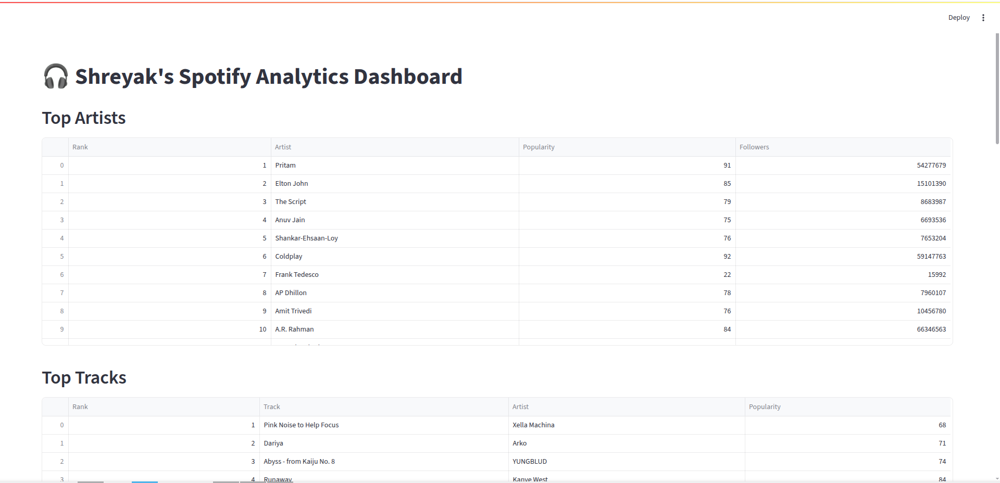

# Spotify Analytics App

A Streamlit-powered dashboard for visualizing your Spotify listening habits. Unlike online analytics platforms, this app runs entirely on your local machine—your Spotify data is never uploaded to any third-party servers. All data processing happens privately and securely on your computer, giving you full control over your listening analytics. The app uses the Spotify Web API (via Spotipy) to fetch your top artists and tracks, providing interactive analytics and visualizations.

## Features

- **OAuth2 Authentication**: Securely connect to your Spotify account.
- **Top Artists & Tracks**: View your top 20 artists and tracks for the medium-term period.
- **Popularity & Followers**: See artist popularity and follower counts.
- **Artist Presence in Top Tracks**: Visual breakdown of how many top tracks each artist has.
- **Detailed Track Listings**: Expandable sections to see your top tracks by each artist.
- **Interactive Visualizations**: Tables and bar charts powered by Streamlit and Plotly.

## Demo

 <!-- Add a screenshot if available -->

## Installation

1. **Clone the repository:**
   ```bash
   git clone https://github.com/yourusername/spotify-analytics-app.git
   cd spotify-analytics-app
   ```

2. **Install dependencies:**
   ```bash
   pip install -r requirements.txt
   ```

3. **Set up Spotify API credentials:**
   - Create a Spotify Developer App at [Spotify Developer Dashboard](https://developer.spotify.com/dashboard/applications).
   - Add a Redirect URI (e.g., `http://localhost:8501`).
   - Create a `.env` file in the project root with the following content:
     ```
     SPOTIPY_CLIENT_ID=your_spotify_client_id
     SPOTIPY_CLIENT_SECRET=your_spotify_client_secret
     SPOTIPY_REDIRECT_URI=http://localhost:8501
     ```

## Usage

1. **Run the Streamlit app:**
   ```bash
   streamlit run app.py
   ```

2. **Authenticate with Spotify:**
   - On first run, you will be prompted to log in to your Spotify account and authorize the app.

3. **Explore your analytics:**
   - View your top artists and tracks.
   - Analyze artist presence in your top tracks.
   - Expand sections to see detailed track listings by artist.

## Requirements

- Python 3.8+
- See [`requirements.txt`](requirements.txt) for Python package dependencies.

## Project Structure

- [`app.py`](app.py): Main Streamlit application.
- [`requirements.txt`](requirements.txt): Python dependencies.
- `.env`: Environment variables for Spotify API credentials (not included in repo).

## Credits

- [Spotipy](https://spotipy.readthedocs.io/) - Python client for the Spotify Web API
- [Streamlit](https://streamlit.io/) - Interactive data apps in Python
- [Plotly](https://plotly.com/python/) - Data visualization

## License

MIT License

---